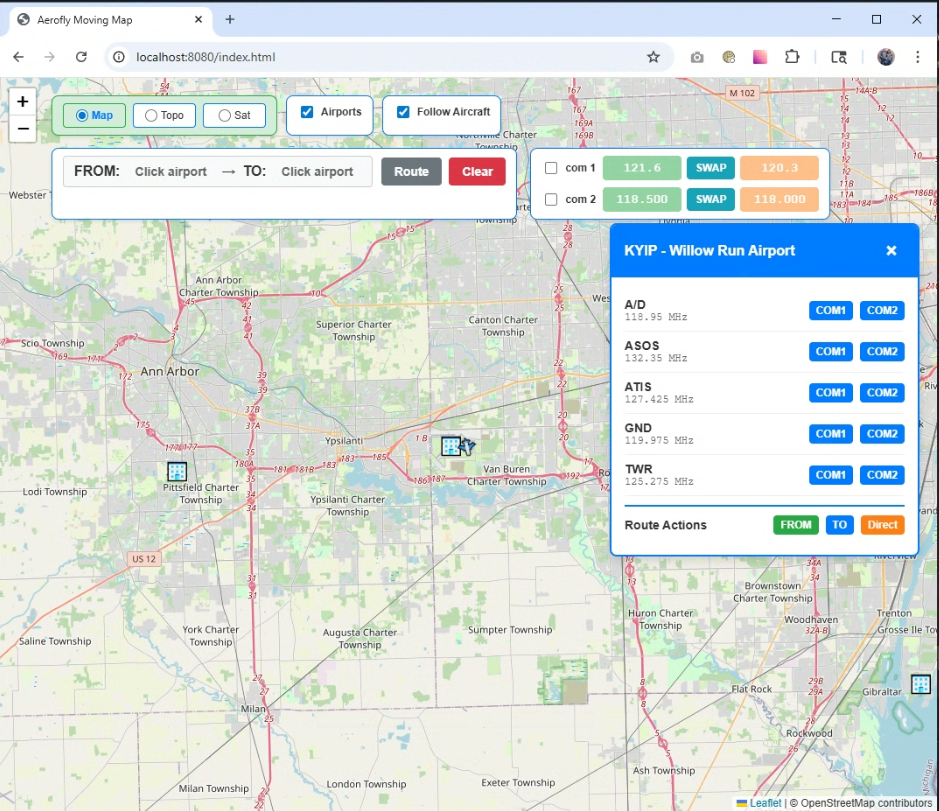

# Aerofly FS4 Data Integration with SayIntentions ATC and Moving Map

This application allows you to connect Aerofly fs4 to SayIntentions ATC using VR or a tablet.  It also has a moving map.

**VERY IMPORTANT:** Read the [instructions.pdf](instructions.pdf) file to see how to set up and install this application.

**Major Interface Change on 8/7/2025**  Functionality is mostly the same.  The radio page was removed and the coms were moved to the map page.  There is no longer a hover over the airport icon.  However when you click on a airport you get a dialog box were you can select the frequency for com 1 or com 2 by clicking the button and that frequency will automatically be added to the standby side of the com.  Much easier to use in VR.  The videos still show how most of it works just no more radio page and different on how you add frequencies. 

**NOTE** Improvements and features to this project will be documented in the changLog.txt file.

I created a part one and part two demo videos that shows it working.

### Part one  
https://www.youtube.com/watch?v=HdENvmPJ-hk

### Part two  
https://www.youtube.com/watch?v=gdEtbueMu3A

This is the original script that that I used as a foundation. I modified so I could use my radio interface and connect to SayIntentions ATC and have a moving map. I wanted to give credit to the author of this script.

https://gist.github.com/jlgabriel/fff943a5eb056dc4af664f8e27114996