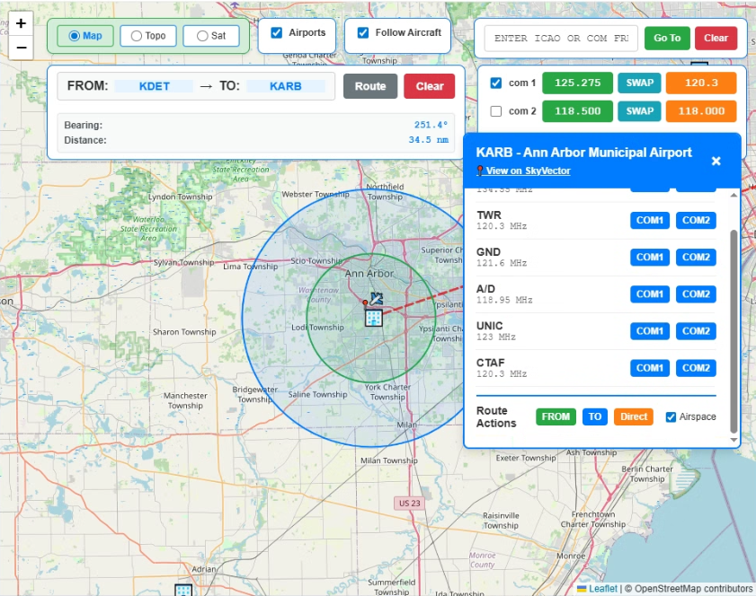

# Aerofly FS4 Data Integration with SayIntentions ATC and Moving Map

This application contains a moving map that lists all the airports in Aerofly FS 4 and it written for VR integration using tools like [OS Overlay](https://store.steampowered.com/app/1173510/XSOverlay/).  In addition, this application allows you to connect Aerofly fs4 to SayIntentions ATC.  This application can be used in VR or on a seperate tablet.

**VERY IMPORTANT:** Read the [instructions.pdf](instructions.pdf) file to see how to set up and install this application.

**Latest Update Screenshot**
Shows the 5nm and 10nm rings

**Update 8/10/2025**  Feature was added to put 5nm and 10nm rings around any airport or multiple airports.

**Update 8/9/2025**  Box was added so you can go to an airport by entering its icao and clicking Go To. This will not move the plane there but will move the map to that airport.  Make creating from to routes much easier.  Pop up simple keyboard was added so you could enter ICAO's and frequencies.  On the keyboard two buttons were added "com 1" and "com 2", if you need to enter a custom frequencies not associated to that airport but is in SayIntentions.  You can enter it and it will appear in your standby.  Finally, heliport icons are used for airports that are actually heliports.   

**Update 8/7/2025**  Functionality is mostly the same.  The radio page was removed and the coms were moved to the map page.  There is no longer a hover over the airport icon.  However when you click on a airport you get a dialog box were you can select the frequency for com 1 or com 2 by clicking the button and that frequency will automatically be added to the standby side of the com.  Much easier to use in VR.  The videos still show how most of it works just no more radio page and different on how you add frequencies.

**Update 8/6/2025**  Different map modes were changed from dropdown to radio buttons better in VR.

**Videos**

This video demonstrates how to open the app and sayintentions into Aerofly fs4 while in VR using OS Overlay.

https://youtu.be/MGfnTeG3Pkg

This video show a short fight where I use the app to bridge Aerofly fs4 to SayIntentions.  I do taxi, takeoff, transition airspace, and landing request.  I also do route planning. Video is short just over 9 minutes.

https://youtu.be/-inMM5oNABA

I created a part one and part two demo videos that shows it working.  Due to all the updates the vidoes will show the older interface but core funtionality is the same.

### Part one  
https://www.youtube.com/watch?v=HdENvmPJ-hk

### Part two  
https://www.youtube.com/watch?v=gdEtbueMu3A

This is the original script that that I used as a foundation. I modified so I could use my radio interface and connect to SayIntentions ATC and have a moving map. I wanted to give credit to the author of this script.

https://gist.github.com/jlgabriel/fff943a5eb056dc4af664f8e27114996